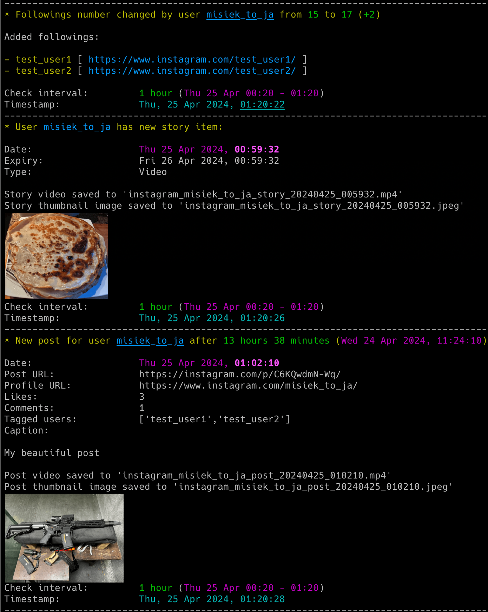
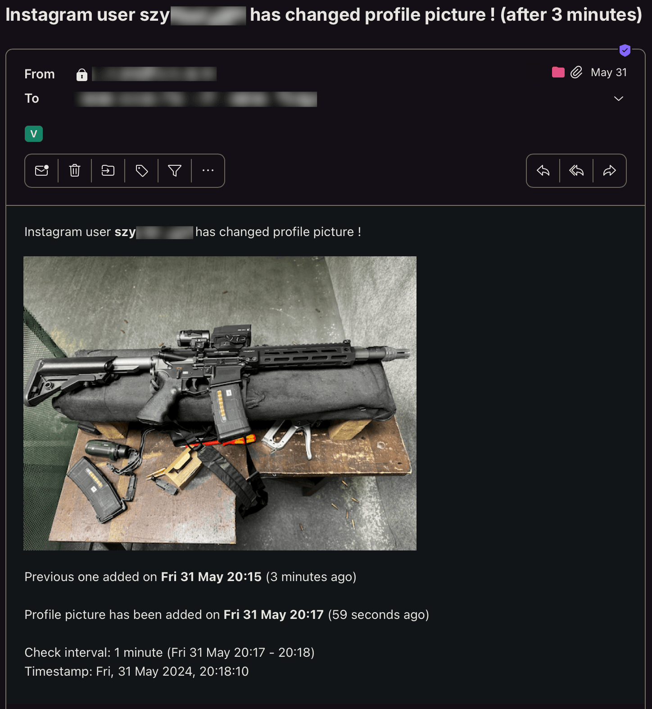

# instagram_monitor

instagram_monitor is an OSINT tool that allows for real-time monitoring of Instagram users' activities and profile changes.

> There's a known issue with `instaloader` (<= 4.14.1) that breaks **[mode 1](#mode-1-without-logged-in-instagram-account-without-session-login)** due to Instagram API changes (data key error).  
> 📦 We're waiting for an updated release.  
> 👉 In the meantime, use **[mode 2](#session-login-using-firefox-cookie)** with a Firefox session cookie.

## Features

- Real-time tracking of Instagram users' activities and profile changes:
  - new posts, reels, and stories
  - changes in followings, followers and bio
  - changes in profile pictures
  - changes in profile visibility (from private to public and vice versa)
- Anonymous download of users' story images and videos; the user won't know you watched their stories 😉
- Download of users' post images and reel videos
- Email notifications for different events (new posts, reels, stories, changes in followings, followers, bio, profile pictures, visibility and errors)
- Attachment of changed profile pictures and stories/posts/reels images directly in email notifications
- Displaying of profile pictures and stories/posts/reels images right in your terminal (if you have *imgcat* installed)
- Saving all user activities and profile changes with timestamps to a CSV file
- Support for both public and private profiles
- Two modes of operation: with or without a logged-in Instagram account
- Various mechanisms to prevent CAPTCHA and detection of automated tools
- Possibility to control the running copy of the script via signals

<p align="center">
   
</p>

## Change Log

Release notes can be found [here](RELEASE_NOTES.md)

## Requirements

The tool requires Python 3.9 or higher.

It uses [instaloader](https://github.com/instaloader/instaloader) library, also requires requests, python-dateutil, pytz and tzlocal.

It has been tested successfully on:
- macOS (Ventura, Sonoma & Sequoia)
- Linux:
   - Raspberry Pi OS (Bullseye & Bookworm)
   - Ubuntu 24
   - Rocky Linux (8.x, 9.x)
   - Kali Linux (2024, 2025)
- Windows (10 & 11)

It should work on other versions of macOS, Linux, Unix and Windows as well.

## Installation

Install the required Python packages:

```sh
python3 -m pip install requests python-dateutil pytz tzlocal instaloader
```

Or from requirements.txt:

```sh
pip3 install -r requirements.txt
```

Copy the *[instagram_monitor.py](instagram_monitor.py)* file to the desired location. 

You might want to add executable rights if on Linux/Unix/macOS:

```sh
chmod a+x instagram_monitor.py
```

## Configuration

Edit the *[instagram_monitor.py](instagram_monitor.py)* file and change any desired configuration variables in the marked **CONFIGURATION SECTION** (all parameters have detailed description in the comments).

### Mode 1 without logged in Instagram account (without session login)

The first mode of tool operation assumes you do not log in with your Instagram account to monitor other users. 

In this way you can still monitor basic activities of the user like new posts, stories, changed bio and also the changed number of followers & followings, but without information on which followers/followings have been added or removed. You also won't be able to get more detailed info about new posts & stories.

This mode is easy to use, does not require any preparation and is resistant to Instagram's anti-captcha and automated tool detection mechanisms.

### Mode 2 with logged in Instagram account (with session login)

The second mode of tool operation assumes you use an Instagram account to perform a session login in the tool to monitor other users. 

This way you can also get information about added or removed followers/followings and more detailed info about new posts and stories.

I suggest creating a new account for use with the tool as there is a small risk the account might get banned. However I have used a few accounts for a long time with this tool and all the accounts are still active. Instagram might occasionally present some warnings about detected suspicious activity.

#### Basic session login (not recommended)

You can define the username and password directly in the *[instagram_monitor.py](instagram_monitor.py)* file (or via **-u** and **-p** parameters) and run the tool in basic session login mode.

However, this means that the session login procedure is performed every time the tool is executed, so it is not advised.

#### Session login via Instaloader (better, but can be quickly detected as an automated tool)

It is definitely a better idea to log in once and save the session information using the **instaloader** tool.

Once you install the instaloader pip package, the needed binary should be available and you can log in as in the example below (user **your_insta_user**):

```sh
instaloader -l your_insta_user
```

It will ask for your password and save the session. However, this method presents an issue: after some time, Instagram will most likely detect the use of an automated tool, especially if there are frequent changes in the followers or followings of the monitored users.

#### Session login using Firefox cookie

To overcome the previous issue, it is suggested to use **the most recommended way**: using the session cookie from your web browser.

Use the Firefox web browser, log in to the Instagram account that you want to use to monitor other users (**your_insta_user**) and then use the *[instaloader_import_firefox_session.py](instaloader_import_firefox_session.py)* tool to import the session from Firefox's *cookies.sqlite* to Instaloader (you might have to adjust the path of your Firefox profile in this script).

This method has the advantage that if you perform activities with this account in your Firefox browser every few days (like scrolling through the feed or liking some posts), it will count as "good" activity, increasing the reputation of the tool's actions. Sometimes you might still see some warnings in your Firefox web browser where you need to click the Dismiss button, but it should not be too often.

### Timezone

The tool will attempt to automatically detect your local time zone so it can convert Instagram timestamps to your time. 

If you wish to specify your time zone manually, change the `LOCAL_TIMEZONE` variable from *'Auto'* to a specific location, e.g.

```
LOCAL_TIMEZONE='Europe/Warsaw'
```

In such case it is not needed to install *tzlocal* pip module.

### SMTP settings

If you want to use email notifications functionality you need to change the SMTP settings (host, port, user, password, sender, recipient) in the *[instagram_monitor.py](instagram_monitor.py)* file. If you leave the default settings then no notifications will be sent.

You can verify if your SMTP settings are correct by using **-z** parameter (the tool will try to send a test email notification):

```sh
./instagram_monitor.py -z
```

### Other settings

All other variables can be left at their defaults, but feel free to experiment with it.

## Getting started

### List of supported parameters

To get the list of all supported parameters:

```sh
./instagram_monitor.py -h
```

or 

```sh
python3 ./instagram_monitor.py -h
```

### Monitoring mode

To monitor specific user activity in [mode 1](#mode-1-without-logged-in-instagram-account-without-session-login) (without performing session login), just type Instagram username as parameter (**insta_user** in the example below):

```sh
./instagram_monitor.py insta_user
```

To monitor specific user activity in [mode 2](#mode-2-with-logged-in-instagram-account-with-session-login) (with session login), you also need to specify your Instagram account name (**-u**) which you used in *instaloader* tool (**your_insta_user**) in the example below):

```sh
./instagram_monitor.py -u your_insta_user insta_user
```

The tool will run indefinitely and monitor the user until the script is interrupted (Ctrl+C) or terminated in another way.

You can monitor multiple Instagram users by launching multiple instances of the script.

It is recommended to use something like **tmux** or **screen** to keep the script running after you log out from the server (unless you are running it on your desktop).

The tool automatically saves its output to *instagram_monitor_username.log* file (can be changed in the settings via `INSTA_LOGFILE` variable or disabled completely with **-d** parameter).

The tool in mode 2 (with session login) also saves the list of followings & followers to these files:
- *instagram_username_followings.json*
- *instagram_username_followers.json*

Thanks to this we do not need to re-fetch it every time the tool is restarted and we can also detect changes since the last usage of the tool.

The tool also saves the user profile picture to *instagram_{username}_profile_pic\*.jpeg* files.

It also saves downloaded posts images & videos to:
- *instagram_{username}_post_YYYYmmdd_HHMMSS.jpeg*
- *instagram_{username}_post_YYYYmmdd_HHMMSS.mp4*

And downloaded stories images & videos to:
- *instagram_{username}_story_YYYYmmdd_HHMMSS.jpeg*
- *instagram_{username}_story_YYYYmmdd_HHMMSS.mp4*

## How to use other features

### Email notifications

If you want to receive email notifications for various events (such as new posts, reels and stories, changes in followings, bio updates, changes in profile picture and visibility) use the **-s** parameter.

```sh
./instagram_monitor.py insta_user -s
```

It does not include information about changed followers. For that use **-m** parameter:

```sh
./instagram_monitor.py insta_user -m
```

Make sure you defined your SMTP settings earlier (see [SMTP settings](#smtp-settings)).

Example email:

<p align="center">
   
</p>


### Saving user activities to the CSV file

If you want to save all Instagram user's activities and profile changes in the CSV file, use **-b** parameter with the name of the file (it will be automatically created if it does not exist):

```sh
./instagram_monitor.py insta_user -b instagram_insta_user.csv
```

### Detection of changed profile pictures

The tool has the functionality to detect changed profile pictures. Proper information will be visible in the console (and email notifications when the **-s** parameter is enabled). By default, this feature is enabled, but you can disable it either by setting the `DETECT_CHANGED_PROFILE_PIC` variable to *False* or by enabling the **-k** / **--do_not_detect_changed_profile_pic** parameter.

Since an Instagram user's profile picture URL appears to change periodically, the tool detects changes to the profile picture by performing a binary comparison of saved JPEG files. Initially, it saves the profile picture to the file *instagram_{username}_profile_pic.jpeg* after the tool is started, then during each subsequent check, the new picture is fetched and the tool performs a binary comparison to determine if it has changed.

In case of changes the old profile picture is moved to *instagram_{username}_profile_pic_old.jpeg* file and the new one is saved to *instagram_{username}_profile_pic.jpeg* and also to the file named *instagram_{username}_profile_pic_YYmmdd_HHMM.jpeg* (so we can have history of all profile pictures).

The tool also has built-in detection of empty profile pictures. Instagram does not indicate an empty user's profile image in their API; that's why we can detect it by using an empty profile image template (which appears to be identical on a binary level for all users).

To use this feature, place the [instagram_profile_pic_empty.jpeg](instagram_profile_pic_empty.jpeg) file in the directory from which you run the script. This way the tool will be able to detect when a user does not have a profile image set.

It is not mandatory, but highly recommended to use as otherwise, the tool will treat an empty profile pic as a regular one, so for example, a user's removal of a profile picture will be detected as a changed profile picture.

### Displaying profile / posts / reels / stories images in your terminal

If you have *imgcat* installed, you can enable the feature of displaying profile pictures and stories/posts images right in your terminal. 

To do this, set the path to your *imgcat* binary in the `IMGCAT_PATH` variable (or leave it empty to disable this functionality).

### Check interval

If you want to change the check interval to 1 hour (3600 seconds), use **-c** parameter:

```sh
./instagram_monitor.py insta_user -c 3600
```

It is generally not recommended to use values lower than 1 hour as it will be quickly picked up by Instagram automated tool detection mechanisms.

In order to make the tool's behavior less suspicious for Instagram, by default the **check interval** value is randomly picked from the range: 

```
[ INSTA_CHECK_INTERVAL (-c) - RANDOM_SLEEP_DIFF_LOW (-i) ]  
                         ⇄  
[ INSTA_CHECK_INTERVAL (-c) + RANDOM_SLEEP_DIFF_HIGH (-j) ]  
```

This means each check will happen after a random delay centered around `INSTA_CHECK_INTERVAL` with some variation defined by `RANDOM_SLEEP_DIFF_LOW` and `RANDOM_SLEEP_DIFF_HIGH`.

So having the check interval set to 1 hour (-c 3600), `RANDOM_SLEEP_DIFF_LOW` set to default 15 mins (-i 900) and `RANDOM_SLEEP_DIFF_HIGH` set to default 3 mins (-j 180) means that the check interval will be with every iteration picked from the range of 45 mins to 1 hour and 3 mins.

That's why the check interval information is printed in the console and email notifications as it is essentially a random number.

On top of that you can also define that checks for new posts should be done only in specific hour ranges by setting `CHECK_POSTS_IN_HOURS_RANGE` to True and then defining proper values for `MIN/MAX_H1/H2` variables (see the comments in [instagram_monitor.py](instagram_monitor.py) file for more information).

### Controlling the script via signals (only macOS/Linux/Unix)

The tool has several signal handlers implemented which allow changing the behavior of the tool without needing to restart it with new parameters.

List of supported signals:

| Signal | Description |
| ----------- | ----------- |
| USR1 | Toggle email notifications for new posts, reels & stories, changed followings, bio, profile picture, visibility (-s) |
| USR2 | Toggle email notifications for new followers (-m) |
| TRAP | Increase the user activity check interval (by 5 mins) |
| ABRT | Decrease the user activity check interval (by 5 mins) |

So if you want to change the functionality of the running tool, just send the appropriate signal to the desired copy of the script.

I personally use the **pkill** tool, so for example, to toggle new followers' email notifications for the tool instance monitoring the **insta_user** user:

```sh
pkill -f -USR2 "python3 ./instagram_monitor.py insta_user"
```

As Windows supports limited number of signals, this functionality is available only on Linux/Unix/macOS.

### Other

Check other supported parameters using **-h**.

You can combine all the parameters mentioned earlier.

## Limitations

The operation of the tool might flag the Instagram account and/or IP as being an automated tool (as described earlier).

## Coloring log output with GRC

If you use [GRC](https://github.com/garabik/grc) and want to have the tool's log output properly colored you can use the configuration file available [here](grc/conf.monitor_logs)

Change your grc configuration (typically *.grc/grc.conf*) and add this part:

```
# monitoring log file
.*_monitor_.*\.log
conf.monitor_logs
```

Now copy the *conf.monitor_logs* to your *.grc* directory and instagram_monitor log files should be nicely colored when using *grc* tool.

## License

This project is licensed under the GPLv3 - see the [LICENSE](LICENSE) file for details
